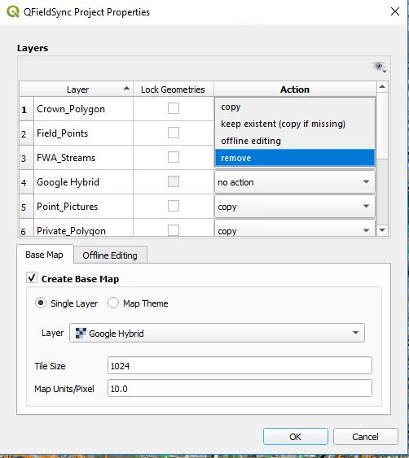
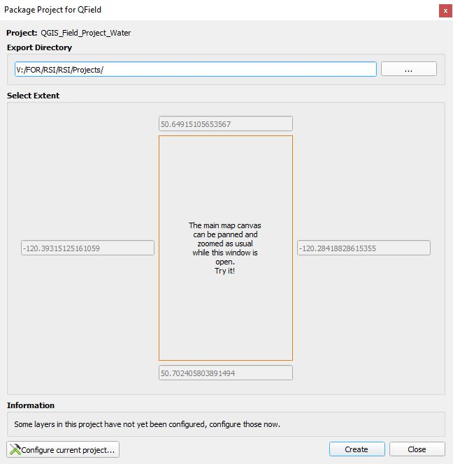

# QFIELD application in QGIS

## Index
* [What is QFIELD](#What-is-QFIELD)
* [Basic steps from QGIS to QFIELD](#What-is-QFIELD)
* [QField and Geodatpackages](#Quick-Mapservices-Plugin)
* [Qfield Best Practices](#Qfield-Best-Practices)
* [QField Sync Plugin](#QField-Sync-Plugin)
   * [Project Configuration](#Project-Configuration)
   * [Preferences](#Preferences)
   * [Package for QField](#Package-for-QField)
   * [Syncronize from QField](#Syncronize-from-QField)
* [Making a QGIS project for QField](#Making-a-QGIS-project-for-QField)
   * [Add Data to QGIS](#Project-Configuration)
   * [Theme Data](#Preferences)
   * [Package for QField](#Package-for-QField)
   * [Syncronize from QField](#Syncronize-from-QField)
## What is QFIELD

QField is a mobile application built on QGIS open source software platform. The user makes a mapping project in QGIS then converts it to a QFIELD mobile project. The user can then assess or collect data in the field and then syncronize it back to the master QGIS data sources that the mapping project was created from. The Qfield interface is simple to use as most of the set up is completed in the QGIS project before exporting to a QField project.

Currently Qfield is only built for Android operating systems, though Apple IOS is currently in development.

## Basic steps from QGIS to QFIELD and Back
 For new users to QGIS or QField, the basic steps for using QField is as follows.
 1. Create a new QGIS project in a project folder
 2. Add features from data sources into QGIS and theme appropriately
 3. Load the Qsync plugin
 4. Run the Package for Qfield. Selecting how you want layers to be used as offline or editable. Export the package to a new folder
 5. Take the new package folder and move it to your mobile device
 6. Open Qfield on your tablet and open the .qgs file in the package folder
 7. Collect field work on device using QField
 8. Copy Qfield package from device to computer and Sync back to the master dataset

## Qfield and GeodataPackages
QField claims that many data types can be used in the data sources. These include Geodatapackages, Shapefiles, SpatialLite, PostGIS. For now it is reccomended to use Geodatapackages as they provide a consolidated data package that QGIS works will with. Shapefiles can also be used in QGIS, but it will create many more files in your QField package. 

## Qfield Best Practices
QField is an effective mobile mapping solution, however there are some best practices to make the application work effectively and minimize potential bugs/issues.

1. Set your QGIS project to relative paths.
2. Use Geodatapackages. Other formats can be used, though reliability has not been tested
3. Projections: QGIS and QField can use different projection sources in the data, though if issues arise a common projection of data may be beneficial.

## QField Sync Plugin

### Configure Current Project (QField Sync Project Properties)
Allows the user to control how data will be used when packaged from QGIS to a QField package

### Choices include:
1. Lock Geometry for data copied to Qfield package
2. Action: (Copy) data for use in QField package
3. Action: (Offline Editing) Allow user to edit data in QField package
4. Action: (Remove) Do not Package data for use in QField package
5. Action: (Keep Existent) If data is already in a previous QField package then keep the existing data.

6. Base Map. An image basemap can be created from an image layer. **This may require the image to be in the same projection as the data or it may not work.
7. Offline editing. Only copy features in the QGIS Map Area of Interest Window.

### Preferences
Where you can set your default import and export directories

### Package For QField

1. Select export directory
2. Select Extent by zooming in view window the area of data you would like to export to QField.

### Syncronize from QField
1. Open the Original QGIS project .qgs then select folder where the Qfield package data collected in the field was placed
2. Then Syncronize and original QGIS data will be updated with data from field.

# Making a QGIS project for QField

### 1. Start a QGIS project, Settings and Project Folders
#### a. Open a new QGIS project and save to a location where you will be placing your QField data.

### 2. Adding data and Theming

### 3. Adding imagery
#### Offline Imagery: When in the field many areas may not have data so data can be loaded to the device with the project. Though it is advised to keep imagery areas small as it can quickly use up device memory.

#### Online Imagery: This can be added as a datasource and will load in QField if your field device has data. The benefits of this method mean that large imagery datasets do not have to be added to the device which can quickly use up memory

### 4.

### 5.

### License
    Copyright 2019 BC Provincial Government

    Licensed under the Apache License, Version 2.0 (the "License");
    you may not use this file except in compliance with the License.
    You may obtain a copy of the License at

       http://www.apache.org/licenses/LICENSE-2.0

    Unless required by applicable law or agreed to in writing, software
    distributed under the License is distributed on an "AS IS" BASIS,
    WITHOUT WARRANTIES OR CONDITIONS OF ANY KIND, either express or implied.
    See the License for the specific language governing permissions and
    limitations under the License.
