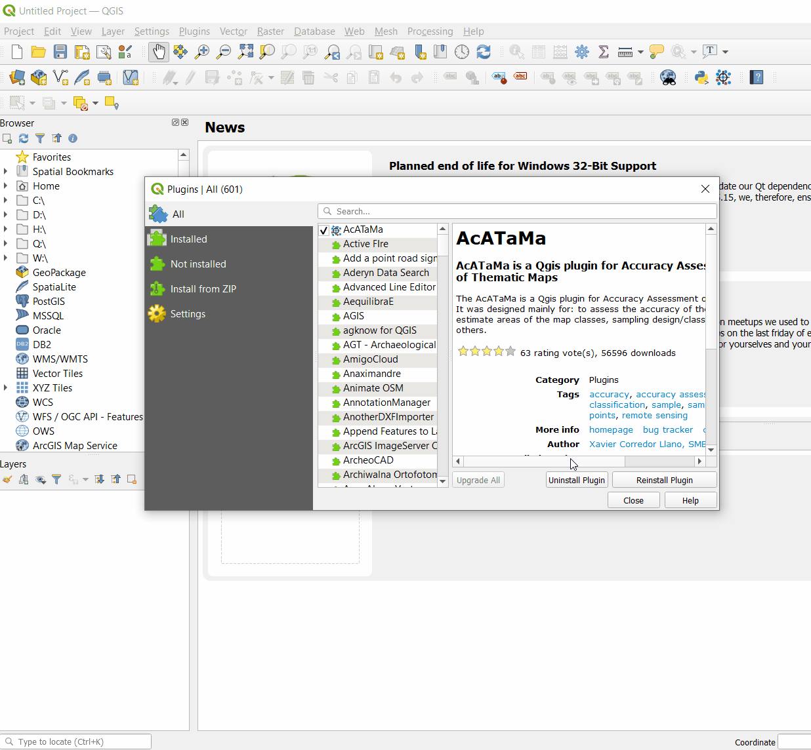
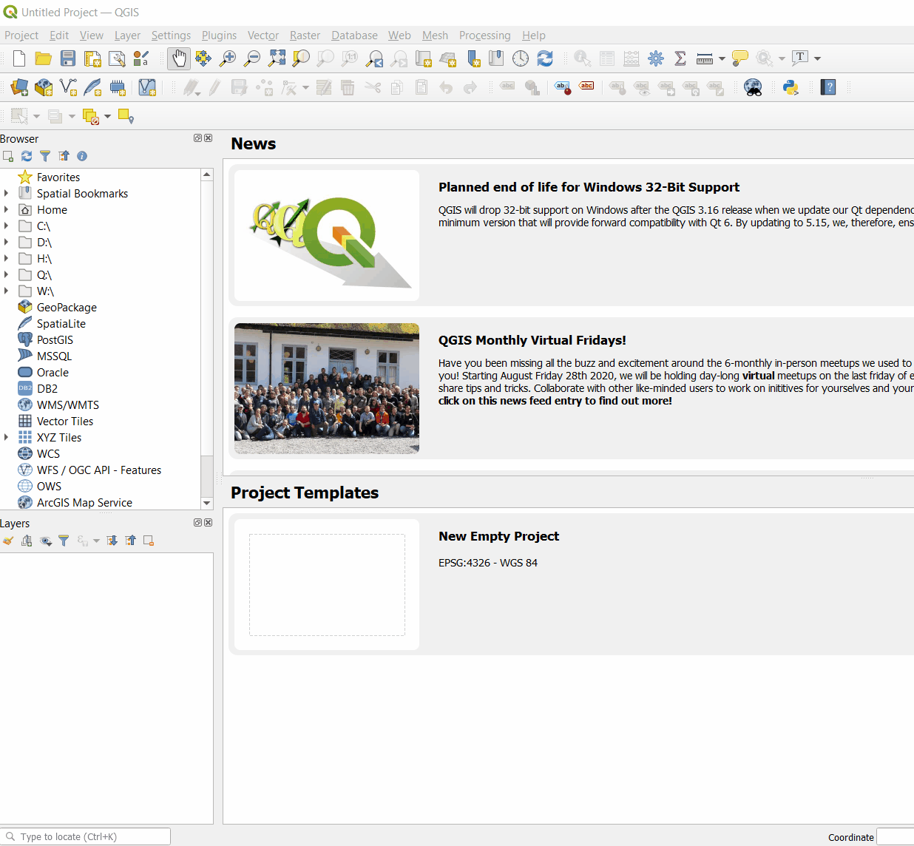
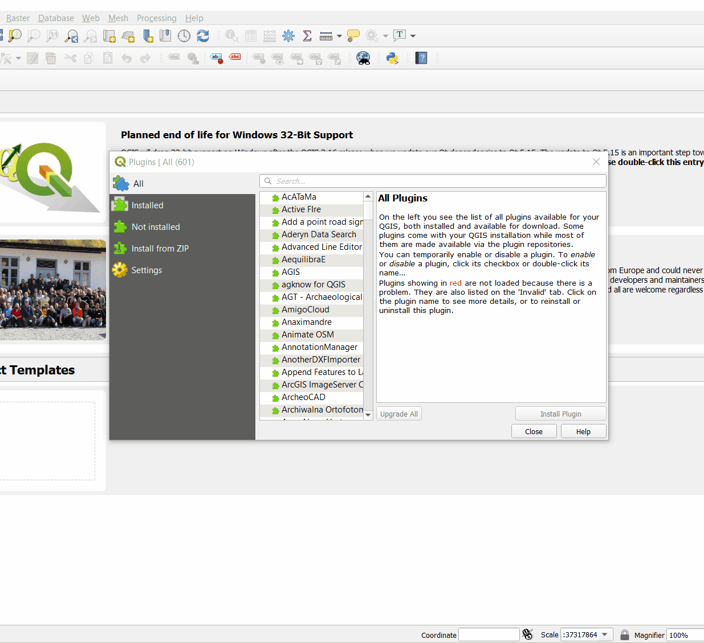
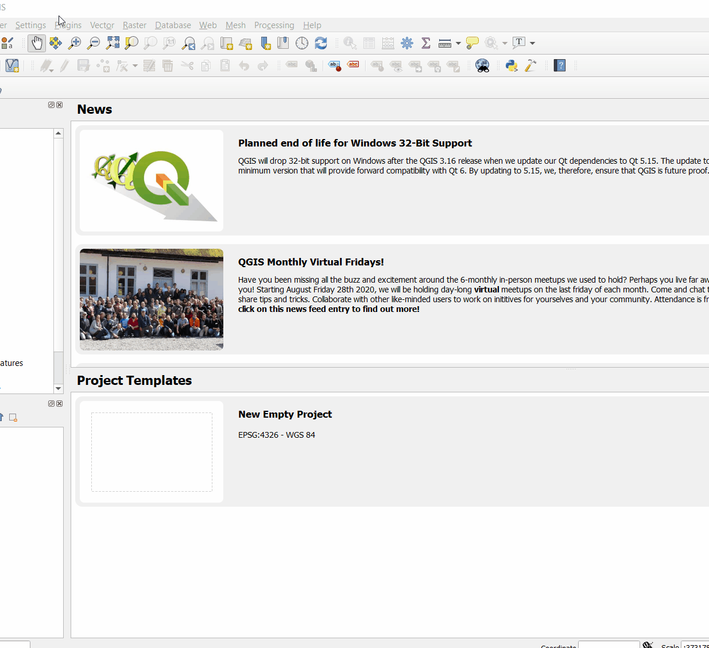
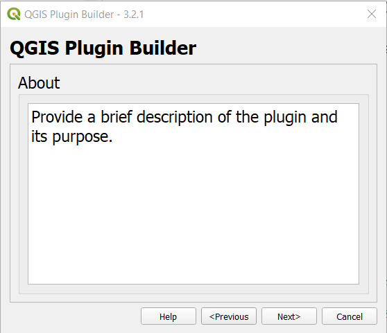
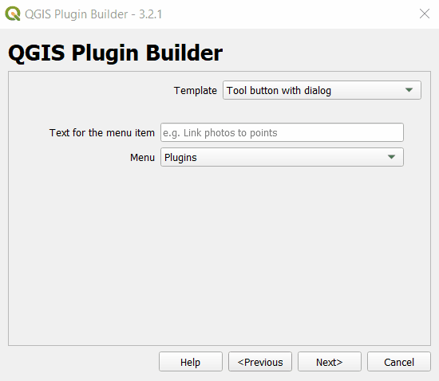
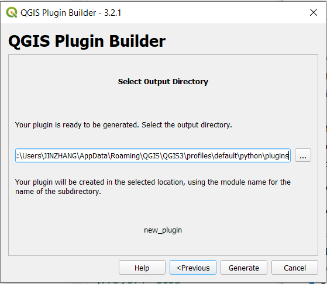
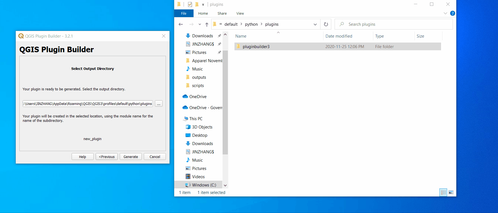
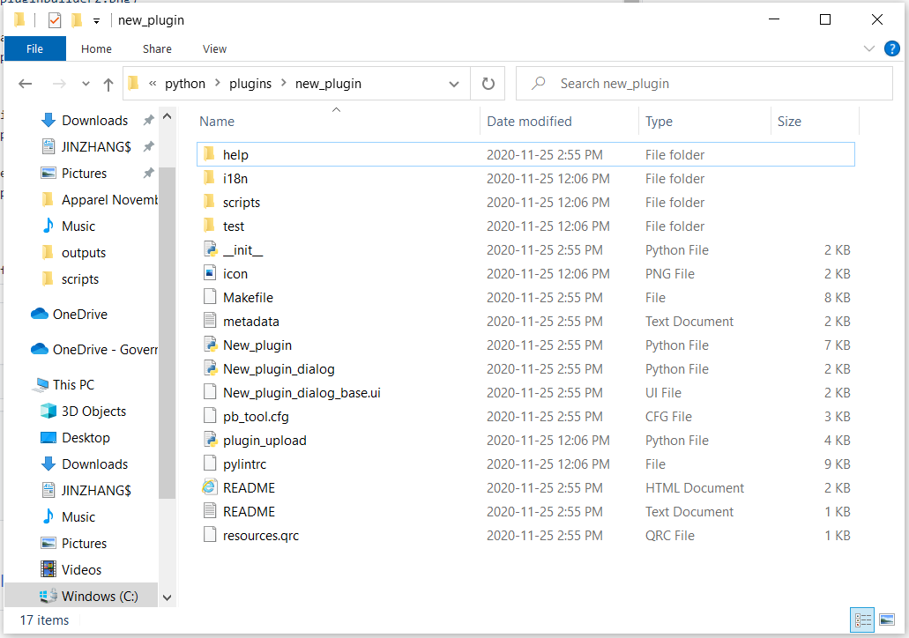

[home](../readme.md)

[QGIS Plugin repository](https://plugins.qgis.org/)

# Introduction
To enhance a software's capabilities, there are usually add-ons that can be activated or downloaded. We call these plugins. As with other GIS software, QGIS also has many plugins at your disposal. There is an extensive list of plugins ready to be installed should you choose to do so. 

# Installation 
To install plugins, select **Manage and Install Plugins…** from the **Plugins** menu. Search for the plugin that you need for your tasks and from there the installation is just a button away. Depending on the type of plugin, it could appear within a toolbar with the existing tools loaded into your QGIS session, or it may fall under one of the Menu Bar menus.

# Uninstallation
Uninstallation of a plugin you've installed is also easy, simply click **Uninstall Plugin** in the plugin page in the Plugins Window.

# Other Options
On the left of the Plugins Window, you can see different options to filter the plugin list, such as **Installed** or **Not Installed**. 

In some cases you may have a plugin that is not published and not listed in the **All** plugins list. If so, you are able to install the plugin from a .zip file. 

Last but not least, you can update the plugin settings under the **Settings** section. This is where you can tell the Plugins Window to also show any experimental plugins available that may allow for more functionality within QGIS, for example.

# Build Your Own Plugins 
If you are more advanced in QGIS and would like to build your own plugins there is one way you can achieve that. 

1. Under **Plugins** > **Settings**, check the box for **Show also experimental plugins**. And then go back to **All**, search for **Plugin Builder 3** and install this plugin.

2. After you have the **Plugin Builder 3** tool installed, you can see it under **Plugins** from the Main menu. From here you can follow the steps and create your own plugins.

3. For the first and second page inside the **Plugin Builder** dialog, some information needs to be entered. Here is an example.

4. On the third page, you have the option to choose the style of your widgets. You can choose these according to your needs.

5. Then keep the defaults on the fourth and fifth page as is or update the information as you need. Next you'll need to point the tool to the correct plugin folder on your computer. 

* Note: You might not automatically see the **AppData** folder as it is hidden by default. You'll have to turn it on yourself in the File Explorer.

6. After clicking on the **Generate** button, a new folder will appear inside the plugin folder you pointed to earlier. 

* Note: There will be a pre-established file structure with the new plugin folder.

7. These new folders contain all the main components that a new plugin needs to help you get started. To add functionality into your plugins follow these steps:
* Open the .ui file inside Qt Designer. 
* Create an interface layout that will work for your plugin. 
* Add python codes with functionality inside xxxx_dialog.py
* Activate and reload plugin inside QGIS.

8. With this you are now ready to start using your custom-made plugin within QGIS.

